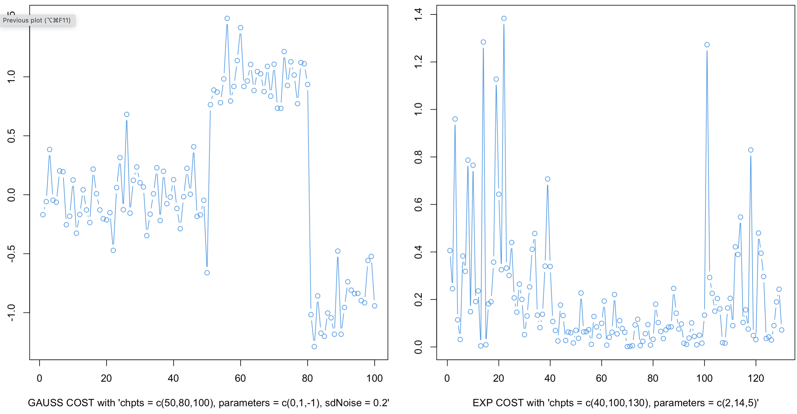

# dust Vignette

### Vincent Runge and Simon Querné
#### LaMME, Evry University, August 31, 2024

___ 

> [Quick start](#start)

> [Models and data generators](#Models)

> [Rcpp Structure](#rcpp)

> [dust 1D Algorithms](#dust1D)

> [dust multiD Algorithms](#dustmD)

> [dust 2D Algorithms](#dust2D)

> [Pruning Capacity](#pruning)

> [Hidden Functions and Parameters From Package Development](#hidden)

## Quick start

### Introduction

The `dust` package contains methods **for detecting multiple change-points within time-series** based on the optimal partitioning algorithm, which is a dynamic programming (DP) algorithm. Our algorithms optimize a penalized likelihood and the DP algorithm is encoded with pruning rules for reducing execution time. The novelty of the `dust` package consists in its pruning step. We use a **new pruning rule**, different from the two standard ones: [PELT rule (2012)](https://doi.org/10.1080/01621459.2012.737745) and [FPOP rule  (2017)](https://doi.org/10.1007/s11222-016-9636-3).  

We called this method the **DUST** pruning rule, standing for **Du**ality **S**imple **T**est. This method is based on considering some constrained optimization problems and its dual for discarding indices in the search for the last change-point index.

Data are modeled by a cost derived from the **exponential family** (Gauss, Poisson, Exponential...). We provide a polymorphic structure in Rcpp **allowing any User to easily add a new cost** of their own choice. The steps to follow are described in details [in this Section](#rcpp). The User only have to provide two Rcpp functions: the (primal) cost function and its dual, in addition with the expression for min (for primal) and max (for dual) values.

Various tests and simulations are provided in this **readme file** and in the **simulation folder** and show that the dust dual approach is **highly efficient in all regimes** (many or few changes) with improved time efficient comparing to PELT and FPOP. Furthermore, unlike these 2 methods, the DUST method is capable of reducing time for multivariate cost functions (See Section [2D](#dust2D) and [multiD](#dustmD)).

### Installing the dust Rcpp package

**REQUIREMENTS:**
- R >= 3.4
- devtools : `install.packages('devtools')`

The package can then be installed from the github repo with the following command:
    
    devtools::install_github("vrunge/dust")

and imported with:

    library(dust)

### A simple example

We generate some 1D time series from the Gaussian model and one change in the middle of the sequence.

`data <- dataGenerator_1D(chpts = c(200,400), c(0,1), type = "gauss")`

We segment data using the dust 1D method coded in Rcpp. We give data, the penalty value and the type of cost to be used. It can be one of the following: `"gauss"` (additional parameters `sdNoise` and `gamma`), `"exp"`, `"poisson"`, `"geom"`, `"bern"`, `"binom"` (additional parameter `nbTrials`), `"negbin"` (additional parameter `nbSuccess`). See next [Section](#Models).

`dust_1D(data, penalty = 2*log(length(data)), type = "gauss")`

The result is a list whose elements are:

- `chpts `A vector of change points (the index ending each of the segments)

- `cost` The global cost of the segmentation: the sum of each of the segment cost.

[Back to Top](#top)

___ 

## Models and data generators

### Costs derived from the exponential family

### Data Generators in 1D

**dataGenerator_1D** is used to generate data with a given vector of change-point (e.g. `chpts = c(50,100)` for one change at position `50` and data length `100`), parameter vector (e.g. `parameters = c(0,1)`) and a type of probability distribution (from the exponential family) in `type`. The following types are available in the current package version:
  
- `type = "gauss"` (additional parameters `sdNoise` and `gamma`)

- `type = "exp"` 

- `type = "poisson"`

- `type = "geom"` 

- `type = "bern"` 

- `type = "binom"` (additional parameter `nbTrials`)

- `type = "negbin"` (additional parameter `nbSuccess`)

We show two data examples with Gaussian and Exponential models (`"gauss"`, `"geom"`, `"binom"`, `"negbin"`)

and some other examples with integer-valued cost (`"poisson"` and `"exp"`):

### Data Generators in 2D and multiD

**dataGenerator_MV** is used for change in mean and variance for the Gaussian problem

**dataGenerator_Reg** generates 2-dimensional data frame `(x,y)` following a simple linear regression link (`y = Ax + B + noise`) with `A` and `B` changing over time (after each change-point)

**dataGenerator_MultiD** concatenates `p` copies of `dataGenerator_1D` function.

Additional information and examples are easily accessible in the help of these functions (e.g. run `?dataGenerator_MultiD`).

___ 

## Rcpp Structure

[Back to Top](#top)

___ 

## dust 1D Algorithms

[Back to Top](#top)

___ 

## dust 2D Algorithms

[Back to Top](#top)

___ 

## dust multiD Algorithms

[Back to Top](#top)

___ 

## Pruning Capacity

### OP in R

The base function `OP_R` is used to compute the change-point vector with the simplest dynamic programming algorithm with no pruning. This method is of quadratic time complexity. We propose 3 such functions:`OP_R_1D`, `OP_R_MultiD`, `OP_R_2param`.

`OP_R_1D <- function(data, penalty = 2*log(length(data)), type = "gauss")`

Example: `OP_R_1D(dataGenerator_1D(chpts = c(200,400), c(0,1), type = "gauss"))`

`OP_R_2param` is used for:

- `type = "meanVar"` change in Gaussian data in mean and variance

- `type = regression` change in simple regression model

### Dual Functions
  
`dual_1D` returns the value of the dual at a point `mu` when comparing index `s1` with the constraint from index `s2` at time `t`. With option `OP = TRUE` the optimal partitioning algorithm is used to have the true constants in the cost functions with penalty `penalty` and a pruning option `pruningOpt`.

`dual_1D <- function(mu, data, s1, s2, t, type = "gauss", OP = FALSE, penalty = 2*length(data), pruningOpt = 3)`

- `data` is raw data

- If `OP` is `true`, we run the OP algorithm to have the optimal cost vector to use in cost functions. See the function `OP_R`.

- at time `t`, we evaluate the dual function at point `mu` when trying to remove index `s1` using function linked to index `s2` (we have a unique constraint, which means that the dual is a one-parametric function)

- Depending on the `type`, different functions `A`, `B`, `statistic`, `mu_max` and `evalDual` are used (see the code in file `functions_by_type.R`)

Function `dual_1D` allows us to study the shape of the dual. 

### dust_R 

We propose a few R functions computing the change-point location with dust method: `dust_R_1D`, `dust_R_MultiD`, `dust_R_2Dquad`.

The function `dust_R_1D` has the following parameters:

`dust_R_1D <- function(data, penalty = 2*log(length(data)), type = "gauss", pruningOpt = 2)`

We have different type of possible pruning:

- `pruningOpt == 0`: nothing

- `pruningOpt == 1`: PELT

- `pruningOpt == 2`: dust

- `pruningOpt == 3`: dust + PELT
  

and returns a list of two elements:

- `changepoints`: the change-points found by the algo

- `nb`: the number of indices to consider in the minimization at each time step

- `lastIndexSet`: the vecotr of indices saved by the algo in the dynamic programming algorithm at the last iteration

- `costQ`: the vector of optimal cost (of size `length(data)`)

### Plot functions 

`plot_dual_1D` is a function displaying the result of `dual_1D` for a vector of mu values.

`plot_dual_1D <- function(mu =  (1:99)/100,`
                         `data, s1, s2,`
                         `type = "gauss",`
                         `OP = FALSE,`
                         `penalty = 2*length(data))`
                         

We use the function `plot_dual_1D` with `OP = TRUE` to plot the true dual function seen by the dynamic programming algorithm. 

What we called the "pruning interval" is the interval of values between the vertical green lines for which the dual function takes a value higher than the pruning threshold (horizontal line in red), so that the index considered `s1` is pruned by `s2` at time `n`. 

Using function `barplot_dual_1D` we can repeat the generation of the pruning interval `nb` and count the number of time each value mu is in this interval.

We add the values in the bar plot only if at the final time step `n`, the index `s1` has not been removed by the algorithm (the pruning option is given by option `pruningOpt`).

`barplot_dual_1D <- function(nb = 1000, s1 = 18, s2 = 15,`
                            `n = 20,`
                            `oneParam = 0,`
                            `type = "gauss",`
                            `penalty = 2*log(n),`
                            `pruningOpt = 3)`
                            

___ 

## Hidden Functions and Parameters From Package Development

[Back to Top](#top)

