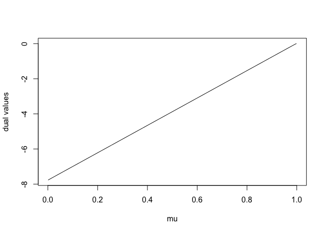
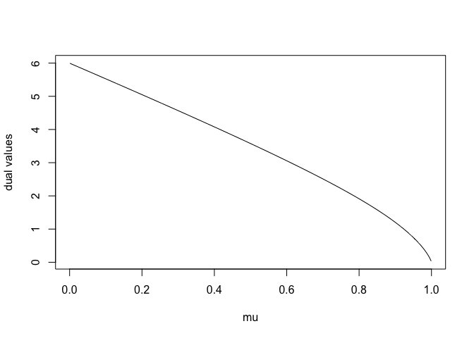
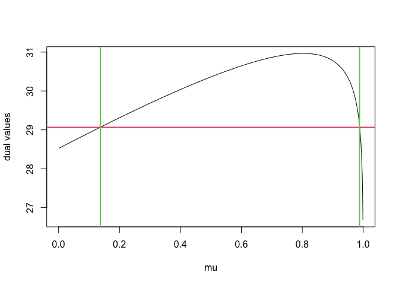
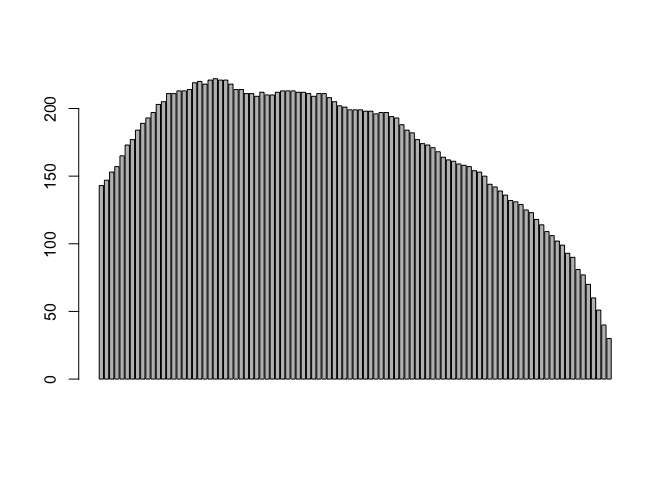
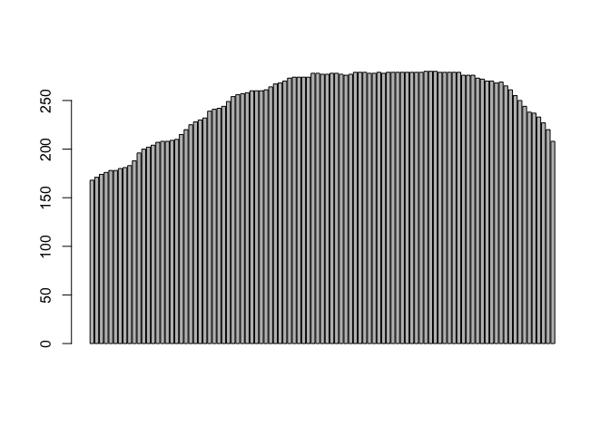
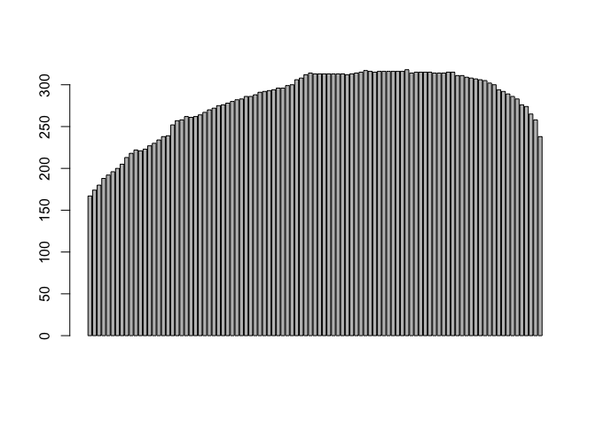
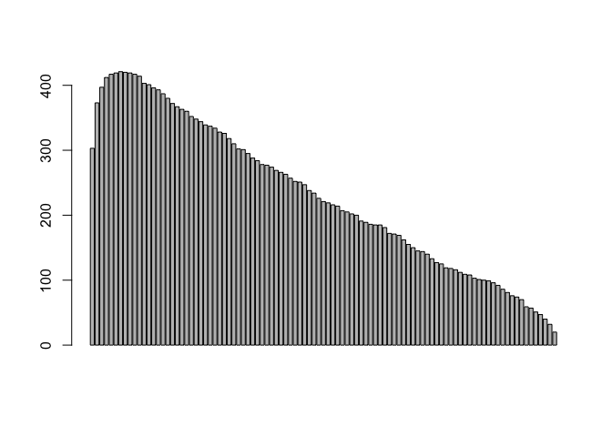

```r
library(dust) #our package
```


# data generators

**dataGenerator_1D** is used to generate data with a given vector of change-point (e.g. `chpts = c(50,100)`), parameter vector (e.g. `parameters = c(0,1)`) and a type of probability distribution in `type`. We have the following choices for type:
  
- `type = "gauss"` (parameter `sdNoise` and `gamma`)

- `type = "exp"` 

- `type = "poisson"`

- `type = "geom"` 

- `type = "bern"` 

- `type = "binom"` (parameter `nbTrials`)

- `type = "negbin"` (parameter `nbSuccess`)


```r
dataGenerator_1D(chpts = c(50,100), parameters = c(0,1), sdNoise = 0.2, type = "gauss")
```

```
##   [1] -0.06410710 -0.23031990 -0.27792825  0.18009586 -0.37921312 -0.08441478
##   [7]  0.07540971  0.08111925 -0.17615882  0.39764937 -0.01110760  0.09576275
##  [13]  0.33644493 -0.05261114  0.16033408  0.16162269  0.26136823  0.19439766
##  [19]  0.05676300  0.09424982  0.16320309  0.37695169  0.16938620 -0.10031042
##  [25]  0.09879668  0.13272741 -0.22281749  0.09677404  0.30240284 -0.03191999
##  [31] -0.05242678 -0.16996254  0.17228063 -0.37277724  0.09844037  0.01803956
##  [37] -0.07353612 -0.05358080  0.04536403 -0.11792338 -0.22748998  0.38364729
##  [43]  0.28975798 -0.01936117  0.06406256  0.28825368  0.04579118  0.16839238
##  [49] -0.11699843 -0.42857849  1.30638170  0.86301397  1.01558297  0.68760571
##  [55]  1.36166976  1.12802026  1.41579991  1.02436916  1.20238994  1.21180775
##  [61]  1.43257033  0.52107916  1.02533315  1.02311208  1.12310562  1.13500875
##  [67]  1.15171825  0.97373471  0.89216780  1.03730797  1.01562903  1.41259460
##  [73]  1.31858958  0.94917698  1.09276248  0.81867041  0.79585022  1.10612339
##  [79]  0.95508890  0.70910116  0.73918417  0.99640370  1.27153044  1.32600638
##  [85]  1.16211335  0.67774093  0.84378964  0.72864589  0.88429612  1.51881673
##  [91]  0.96652528  1.23140913  0.93648832  1.09183753  1.03611608  0.96699344
##  [97]  1.19087478  1.30866457  1.43345320  1.07760730
```

```r
dataGenerator_1D(chpts = c(50,100), parameters = c(0.7,0.2), type = "bern")
```

```
##   [1] 0 1 1 1 1 1 1 1 0 0 1 1 1 1 1 1 1 1 1 1 0 1 0 0 1 1 1 0 1 0 1 0 0 1 0 0 1
##  [38] 1 1 0 0 1 1 1 0 1 0 1 1 1 0 0 0 0 0 0 0 0 1 0 0 0 0 0 0 0 0 0 0 0 1 0 0 0
##  [75] 0 0 0 0 0 0 1 0 0 0 0 0 1 0 0 0 0 1 0 0 0 0 1 0 0 0
```

```r
dataGenerator_1D(chpts = c(50,100), parameters = c(0.4,0.7), nbSuccess = 10, type = "negbin")
```

```
##   [1] 12  8 31 26 22  8 18 22  9 11 17 15 16 14 15 24  8  6 11 17 16 14 16  7 17
##  [26] 26  9  7 20 12 15 13 14  5 24 17 12 10 22  5 11  9 16 13  5 11 13 10 20 12
##  [51]  3  5  2  5  1  4  5  6 11  4  3  5  5  4  1  7  2  3  5  1  2  2  5  3  0
##  [76]  4  4 12  3  7  1  6  3  4  6  4  8  4  3  5  9  6  8  5  4  5  5  3  4  4
```


# Plots of the 1D dual

We first want to verify the behavior of the dual close to its boundary `mu_max`.

We get `-Inf`:

- when `type = "gauss"` 

- when `type = "exp"` and  `mu_max < 1`

- when `type = "poisson"` and  `mu_max = 1`

In all other cases, we get `0`

We fix the index positions


```r
n <- 10
s2 <- 3
s1 <- 5
```

## Case `-Inf` or `0`

### Gauss only `-Inf`


```r
type <- "gauss"
data <- dataGenerator_1D(chpts = n, parameters = 1, type = type)
S <- c(0, cumsum(data))
cat("mu max = ", mu_max(S, shift(s1), shift(s2), shift(n), type))
```

```
## mu max =  1
```

```r
plot_dual_1D(mu = 1:999/1000, data = data, s1 = s1, s2 = s2, type = type)
```

<!-- -->


### exp `-Inf` or `0`

CASE -Inf (`mu_max < 1`)


```
## mu max =  0.8888787
```

<!-- -->

CASE 0 (`mu_max = 1`)


```
## mu max =  1
```

<!-- -->

### poisson `-Inf` or `0`

CASE -Inf (`mu_max = 1`)


```
## mu max =  1
```

<!-- -->

CASE 0 (`mu_max < 1`)


```
## mu max =  0.6
```

<!-- -->


## All cases `0`


### geom 


```
## mu max =  1
```

<!-- -->


### bern 


```
## mu max =  0.4
```

<!-- -->

### binom 


```
## mu max =  0.84
```

<!-- -->


### negbin 


```
## mu max =  1
```

<!-- -->


# Pruning positions


```
## mu max =  1
```

<!-- -->


```r
barplot_dual_1D(nb = 1000, s1 = s1, s2 = s2,
                            n = n,
                            oneParam = 0,
                            type = "gauss",
                            penalty = 2*log(n),
                            pruningOpt = 3)
```

<!-- -->

```
## [1] 3
```


```r
barplot_dual_1D(nb = 1000, s1 = s1, s2 = s2,
                            n = n,
                            oneParam = 5,
                            type = "exp",
                            penalty = 2*log(n),
                            pruningOpt = 3)
```

<!-- -->

```
## [1] 13
```


```r
barplot_dual_1D(nb = 1000, s1 = s1, s2 = s2,
                            n = n,
                            oneParam = 5,
                            type = "poisson",
                            penalty = 2*log(n),
                            pruningOpt = 3)
```

<!-- -->

```
## [1] 31
```


```r
barplot_dual_1D(nb = 1000, s1 = s1, s2 = s2,
                            n = n,
                            oneParam = 0.2,
                            type = "geom",
                            penalty = 2*log(n),
                            pruningOpt = 3)
```

<!-- -->

```
## [1] 4
```


