```r
library(dust) #our package
```


In this document, we study the shape of the 1D dual function for different models in the exponential family.

# data generators

**dataGenerator_1D** is used to generate data with a given vector of change-point (e.g. `chpts = c(50,100)` for one change at position `50` and data length `100`), parameter vector (e.g. `parameters = c(0,1)`) and a type of probability distribution in `type`. We have the following choices for type:
  
- `type = "gauss"` (additional parameters `sdNoise` and `gamma`)

- `type = "exp"` 

- `type = "poisson"`

- `type = "geom"` 

- `type = "bern"` 

- `type = "binom"` (additional parameter `nbTrials`)

- `type = "negbin"` (additional parameter `nbSuccess`)


```r
dataGenerator_1D(chpts = c(50,100), parameters = c(0,1), sdNoise = 0.2, type = "gauss")
```

```
##   [1]  0.375670671  0.147891879 -0.046354838  0.150090589  0.284532925
##   [6] -0.100216812  0.290748802 -0.093759971  0.304516911  0.026134403
##  [11]  0.147760158  0.122047781  0.149485321  0.034828153  0.034309886
##  [16] -0.204456195 -0.708605645  0.142643964 -0.006656119  0.178810877
##  [21]  0.167101343 -0.146960755  0.135581184  0.019031561  0.240873728
##  [26]  0.207286903 -0.194544477 -0.083477229  0.400799705  0.087889456
##  [31] -0.012254752  0.391810052 -0.011859973  0.113549940 -0.085477379
##  [36]  0.167841402  0.312327375  0.001475551 -0.076774671 -0.519221903
##  [41] -0.050603566 -0.020887553 -0.073102428 -0.174416796  0.072591897
##  [46] -0.019110919  0.595048215  0.040054892  0.116788438 -0.096296178
##  [51]  0.938059415  1.104557673  0.868391652  1.030526478  0.962425275
##  [56]  1.038254666  1.205430661  1.178536656  0.732584471  1.265576013
##  [61]  1.135201805  1.167372754  1.052499788  0.548231577  0.761389781
##  [66]  1.041784089  0.969186212  0.969894471  1.374600190  1.138395603
##  [71]  0.660231435  0.877442247  0.898636891  1.286322652  1.077288393
##  [76]  0.765756588  1.230531898  1.216531496  1.058666055  0.831740269
##  [81]  1.383310465  1.164417940  0.727168799  1.016680121  1.152615118
##  [86]  0.976697707  0.893916621  1.336667618  0.924327418  0.669480676
##  [91]  0.826435848  0.761853716  0.865322885  0.852069528  0.883935247
##  [96]  0.938464246  0.958556310  1.291840949  0.952284639  1.059810317
```

```r
dataGenerator_1D(chpts = c(50,100), parameters = c(0.7,0.2), type = "bern")
```

```
##   [1] 1 1 1 1 1 1 0 1 1 0 1 1 1 1 0 0 1 0 1 1 1 0 0 1 1 1 1 0 1 0 1 1 1 0 1 1 0
##  [38] 1 0 1 1 1 1 1 1 1 0 1 1 1 0 1 0 0 0 0 1 0 0 0 1 0 0 0 0 1 0 0 0 0 0 0 1 0
##  [75] 0 0 0 1 0 0 0 0 0 0 1 0 0 0 0 0 0 1 0 0 0 1 0 0 0 0
```

```r
dataGenerator_1D(chpts = c(50,100), parameters = c(0.4,0.7), nbSuccess = 10, type = "negbin")
```

```
##   [1] 20 24 15 14 13 18 22  9 20 32 21 18 26 19 13 13  8 23 19 15 13 14 15 12 21
##  [26] 13 17 12  6 11 14 30 19 12 13 16 12  8 23 18  4 15 24 26 14 13 10 16 12 14
##  [51]  4  4  4  0  6  7  8  3  5  5  2  6  4  1  9  9  5  7  6  6  3  5  7  4 10
##  [76]  3  5  2  4  2  2  8  6  5  5  3  4  1  6  2  7  6  3  5  6  5  2  5  1  3
```


# Limit value of the dual at `mu_max` for all models

We first want to verify the behavior of the dual close to its boundary `mu_max`.

1) We know that we get `-Inf`:

- when `type = "gauss"` 

- when `type = "exp"` and  `mu_max < 1`

- when `type = "poisson"` and  `mu_max = 1`

2) In all other cases, we get `0` for the dual function removing the linear term (all optimal cost in `costQ` set to zero)

We fix the index positions


```r
n <- 10
s2 <- 3
s1 <- 5
```

We use the function `plot_dual_1D` where the parameter `mu = (1:99)/100` by default and is always a re-scaled parameter between 0 and 1. With `OP = FALSE` we don't run any dynamic programming algorithm: the linear term using optimal cost `costQ` is removed.

## Case `-Inf` or `0` for `gauss`, `exp` and `poisson`

### Gauss only `-Inf`


```r
type <- "gauss"
data <- dataGenerator_1D(chpts = n, parameters = 1, type = type)
S <- c(0, cumsum(data))
cat("mu max = ", mu_max(S, shift(s1), shift(s2), shift(n), type))
```

```
## mu max =  1
```

```r
plot_dual_1D(mu = 1:999/1000, data = data, s1 = s1, s2 = s2, type = type)
```

<!-- -->


### exp: `-Inf` or `0`

**CASE -Inf (`mu_max < 1`)**


```
## mu max =  0.8888787
```

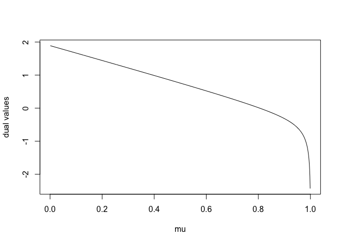<!-- -->

**CASE 0 (`mu_max = 1`)**


```
## mu max =  1
```

<!-- -->

### poisson: `-Inf` or `0`

**CASE -Inf (`mu_max = 1`)**


```
## mu max =  1
```

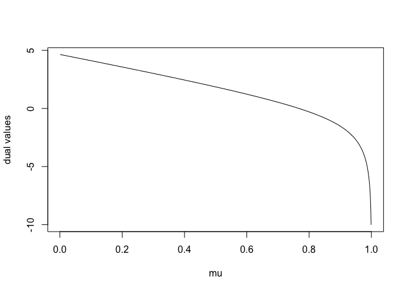<!-- -->

**CASE 0 (`mu_max < 1`)**


```
## mu max =  0.6
```

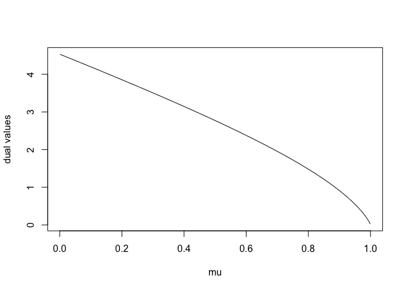<!-- -->


## All cases `0` for `geom`, `bern`, `binom` and `negbin`


### geom 


```
## mu max =  1
```

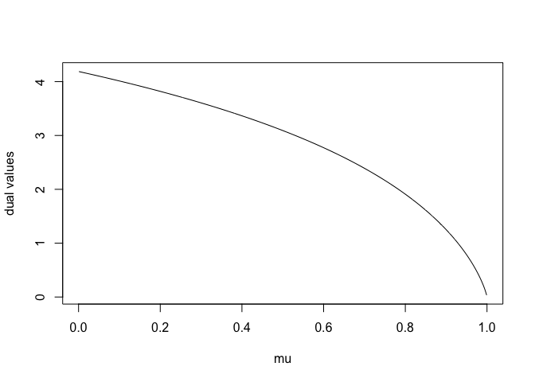<!-- -->


### bern 


```
## mu max =  0.4
```

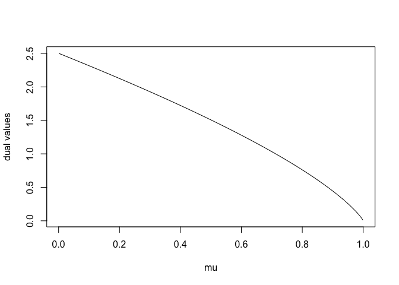<!-- -->

### binom 


```
## mu max =  0.84
```

<!-- -->


### negbin 


```
## mu max =  1
```

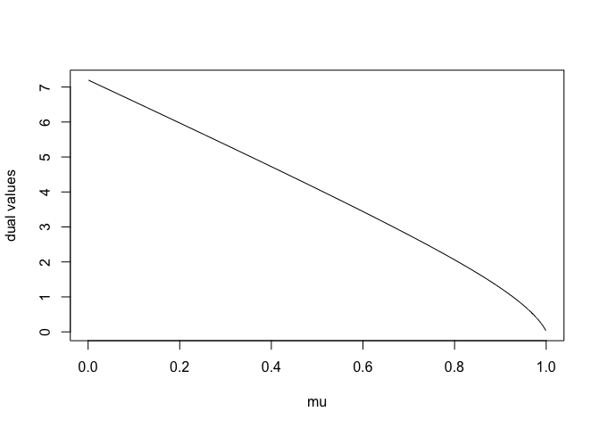<!-- -->


# The 1D dual and its pruning interval

We use the function `plot_dual_1D` with `OP = TRUE` to plot the true dual function seen by the dynamic programming algorithm. 

What we called the "pruning interval" is the interval of values between the vertical green lines for which the dual function takes a value higher than the pruning threshold, so that the index considered `s1` is pruned by `s2` at time `n`. 


## Example with gauss model


```
## mu max =  1
```

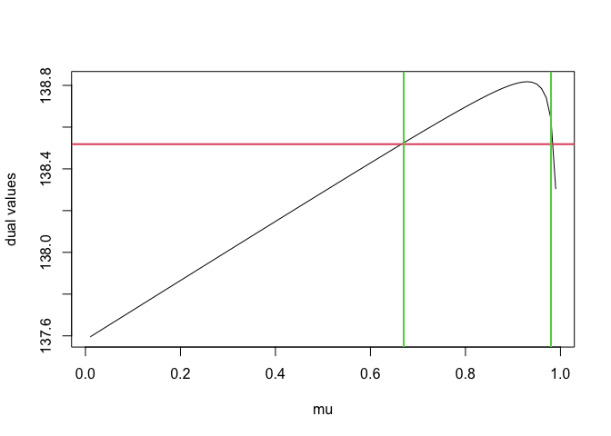<!-- -->

## Example with poisson model


```
## mu max =  0.8496154
```

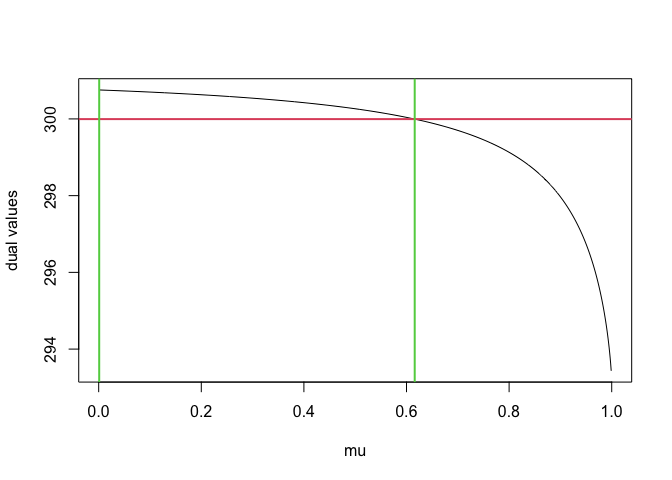<!-- -->


## Example with binom model


```
## mu max =  0.7881773
```

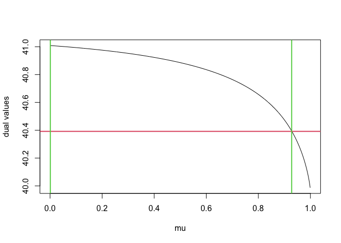<!-- -->

# Study of the pruning intervals

Using function `barplot_dual_1D` we can repeat the generation of the pruning interval `nb` and count the number of time each value mu is in this interval.

We add the values in the bar plot only if at the final time step `n`, the index `s1` has not been removed by the algorithm (the pruning option is given by option `pruningOpt`).

We test different models, different indices, different penalty and pruning options.

## Gauss tests


```r
s1 <- 2
s2 <- 1
n <- 10
barplot_dual_1D(nb = 1000, s1 = s1, s2 = s2,
                            n = n,
                            oneParam = 0,
                            type = "gauss",
                            penalty = 2*log(n),
                            pruningOpt = 0)
```

<!-- -->

```
## [1] 0
```


```r
s1 <- 2
s2 <- 1
n <- 100
barplot_dual_1D(nb = 1000, s1 = s1, s2 = s2,
                            n = n,
                            oneParam = 0,
                            type = "gauss",
                            penalty = 2*log(n),
                            pruningOpt = 0)
```

<!-- -->

```
## [1] 0
```


```r
s1 <- 5
s2 <- 4
n <- 10
barplot_dual_1D(nb = 1000, s1 = s1, s2 = s2,
                            n = n,
                            oneParam = 0,
                            type = "gauss",
                            penalty = 2*log(n),
                            pruningOpt = 0)
```

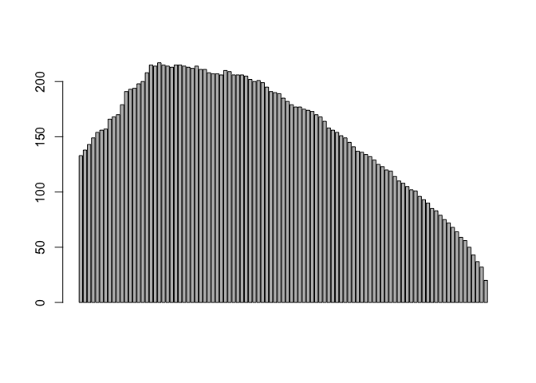<!-- -->

```
## [1] 0
```


```r
s1 <- 5
s2 <- 4
n <- 100
barplot_dual_1D(nb = 1000, s1 = s1, s2 = s2,
                            n = n,
                            oneParam = 0,
                            type = "gauss",
                            penalty = 2*log(n),
                            pruningOpt = 0)
```

<!-- -->

```
## [1] 0
```


```r
s1 <- 40
s2 <- 20
n <- 100
barplot_dual_1D(nb = 1000, s1 = s1, s2 = s2,
                            n = n,
                            oneParam = 0,
                            type = "gauss",
                            penalty = 2*log(n),
                            pruningOpt = 0)
```

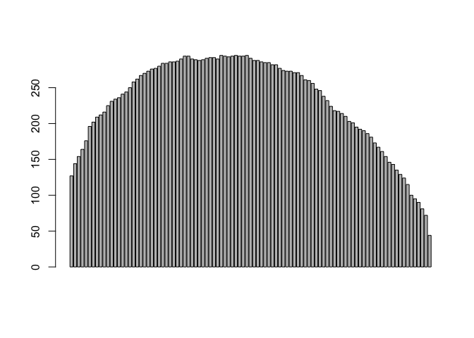<!-- -->

```
## [1] 0
```


```r
s1 <- 98
s2 <- 20
n <- 100
barplot_dual_1D(nb = 1000, s1 = s1, s2 = s2,
                            n = n,
                            oneParam = 0,
                            type = "gauss",
                            penalty = 2*log(n),
                            pruningOpt = 0)
```

<!-- -->

```
## [1] 0
```

Removing when PELT pruned


```r
s1 <- 50
s2 <- 1
n <- 100
barplot_dual_1D(nb = 1000, s1 = s1, s2 = s2,
                            n = n,
                            oneParam = 0,
                            type = "gauss",
                            penalty = 2*log(n),
                            pruningOpt = 1)
```

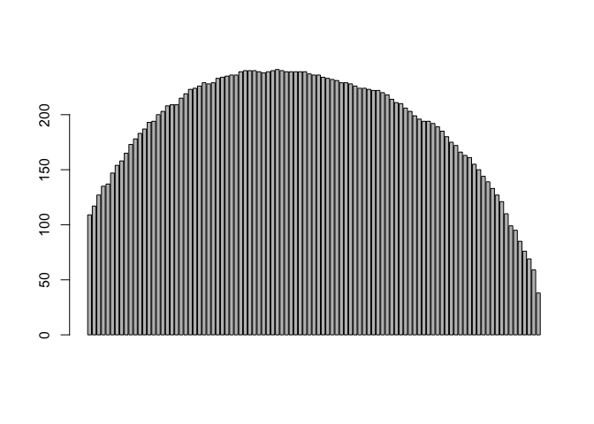<!-- -->

```
## [1] 4
```


## Other tests


```r
barplot_dual_1D(nb = 1000, s1 = s1, s2 = s2,
                            n = n,
                            oneParam = 5,
                            type = "exp",
                            penalty = 4*log(n),
                            pruningOpt = 0)
```

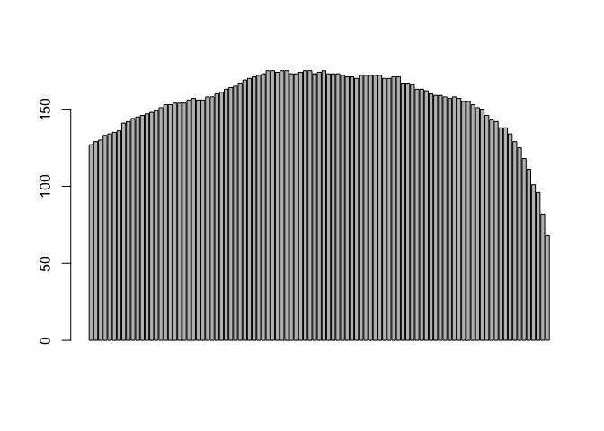<!-- -->

```
## [1] 0
```


```r
barplot_dual_1D(nb = 1000, s1 = s1, s2 = s2,
                            n = n,
                            oneParam = 5,
                            type = "poisson",
                            penalty = 10*log(n),
                            pruningOpt = 0)
```

<!-- -->

```
## [1] 0
```


```r
barplot_dual_1D(nb = 1000, s1 = s1, s2 = s2,
                            n = n,
                            oneParam = 0.2,
                            type = "geom",
                            penalty = 5*log(n),
                            pruningOpt = 0)
```

<!-- -->

```
## [1] 0
```


# Conclusions

We need to adapt the threshold penalty for non-Gaussian models.

Pruning with dual seems more efficient for small mu parameter values that for values close to the right boundary `mu_max`...

We need a more theoretical approach to say interesting things... What's is happening with large data for the dual? Can we do better than a uniform random mu estimation?...


