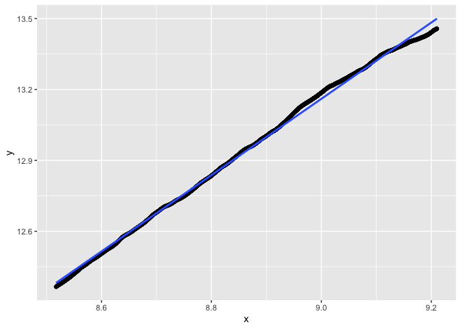

``` r
library(dust) #our package
```


# Pruning capacity


## Gauss


``` r
n <- 10^3
pen <- 2*log(n)
p <- 2
dataM <- dataGenerator_MD(n, parameters = data.frame(matrix(0, ncol = p, nrow = 1)), type = "gauss")
res3 <- dust_R_MD(data = dataM, penalty = p*pen, type = "gauss", pruningOpt = 2)

cat(sum(res3$nb)/sum(1:n)*100, "%. Nb indices left at n: ", length(res3$lastIndexSet))
```

```
## 4.831568 %. Nb indices left at n:  33
```

``` r
regIndices(res3$nb, remove = 500)
```

```
##              Estimate  Std. Error    t value   Pr(>|t|)
## (Intercept) 0.0521807 0.029819096   1.749909 0.08074992
## x           1.4487553 0.004514931 320.880932 0.00000000
```

```
## `geom_smooth()` using formula = 'y ~ x'
```

<!-- -->


``` r
n <- 10^3
pen <- 2*log(n)
p <- 5
dataM <- dataGenerator_MD(n, parameters = data.frame(matrix(0, ncol = p, nrow = 1)), type = "gauss")
res3 <- dust_R_MD(data = dataM, penalty = p*pen, type = "gauss", pruningOpt = 2)

cat(sum(res3$nb)/sum(1:n)*100, "%. Nb indices left at n: ", length(res3$lastIndexSet))
```

```
## 4.784416 %. Nb indices left at n:  76
```

``` r
regIndices(res3$nb, remove = 500)
```

```
##              Estimate  Std. Error   t value      Pr(>|t|)
## (Intercept) -3.526368 0.038620333 -91.30859 3.691152e-313
## x            1.963246 0.005847533 335.73926  0.000000e+00
```

```
## `geom_smooth()` using formula = 'y ~ x'
```

<!-- -->

