```r
library(dust) #our package
```

**We demonstrate using simulations that the number of non-pruned elements is of order `sqrt(n)` for `n` data points when using the dust method with uniform sampling.**

This result is true for all the model considered and all possible penalty values.

It remains to prove it formally...

# Testing with 100 data points with Gauss model

We test the `dust_R_1D` function with different pruning options and different data models.


```r
data <- dataGenerator_1D(chpts = 100, parameters = 0, sdNoise = 1, type = "gauss")

(res0 <- dust_R_1D(data, type = "gauss", penalty = 2*log(100), pruningOpt = 0)) #no pruning
```

```
## $changepoints
## [1] 100
## 
## $nb
##   [1]   1   2   3   4   5   6   7   8   9  10  11  12  13  14  15  16  17  18
##  [19]  19  20  21  22  23  24  25  26  27  28  29  30  31  32  33  34  35  36
##  [37]  37  38  39  40  41  42  43  44  45  46  47  48  49  50  51  52  53  54
##  [55]  55  56  57  58  59  60  61  62  63  64  65  66  67  68  69  70  71  72
##  [73]  73  74  75  76  77  78  79  80  81  82  83  84  85  86  87  88  89  90
##  [91]  91  92  93  94  95  96  97  98  99 100
## 
## $lastIndexSet
##   [1]   0   1   2   3   4   5   6   7   8   9  10  11  12  13  14  15  16  17
##  [19]  18  19  20  21  22  23  24  25  26  27  28  29  30  31  32  33  34  35
##  [37]  36  37  38  39  40  41  42  43  44  45  46  47  48  49  50  51  52  53
##  [55]  54  55  56  57  58  59  60  61  62  63  64  65  66  67  68  69  70  71
##  [73]  72  73  74  75  76  77  78  79  80  81  82  83  84  85  86  87  88  89
##  [91]  90  91  92  93  94  95  96  97  98  99 100
## 
## $costQ
##   [1] -0.3347044774 -0.6658396051 -1.0801905051 -1.0305364602 -1.2019386399
##   [6] -0.9376116519 -0.9161924378 -0.9604763200 -1.3904946111 -2.5567676151
##  [11] -2.5411486566 -2.4810200014 -2.4291389961 -2.3926141800 -1.9391174804
##  [16] -1.4966141566 -1.7861523874 -1.3334451295 -1.3906370941 -1.1142596823
##  [21] -0.9791601433 -1.1609095011 -1.1433646981 -1.1149737409 -0.8526824049
##  [26] -0.6301843814 -0.6222215551 -0.6017668112 -0.6596819213 -0.5158149785
##  [31] -0.8050260165 -1.0023215045 -0.6106589681 -0.6088327779 -0.4852818834
##  [36] -0.3893055440 -0.3139561396 -0.2739655353 -0.2510972539 -0.2981705939
##  [41] -0.1560014240 -0.1907426958 -0.1450229327 -0.1330924492 -0.0734944769
##  [46] -0.0034512814 -0.0019164915 -0.0001666156 -0.0230720268 -0.0092960844
##  [51] -0.0113020027 -0.0009137689 -0.0067436841 -0.0018533869 -0.0189707338
##  [56] -0.0299560881 -0.0044526363 -0.0080004098 -0.0035640380 -0.0075644494
##  [61] -0.0005193821 -0.0003705639 -0.0025428900 -0.0008351187 -0.0645339280
##  [66] -0.0759358851 -0.0371177652 -0.0383809017 -0.0424702890 -0.0137868879
##  [71] -0.0072461304 -0.0007292457 -0.0238705688 -0.0195699722 -0.0505128994
##  [76] -0.0836287964 -0.0685970629 -0.0656450393 -0.1243443377 -0.0782815763
##  [81] -0.1038654000 -0.1544777279 -0.2539095146 -0.2625450662 -0.3006949770
##  [86] -0.3299302569 -0.4500297210 -0.4968036546 -0.7439634933 -0.6983010264
##  [91] -0.6726709447 -0.6114155522 -0.6928221593 -0.4899996004 -0.5770639171
##  [96] -0.4579656638 -0.3749536343 -0.6767458387 -0.5626281442 -0.4837635093
```

```r
(res1 <- dust_R_1D(data, type = "gauss", penalty = 2*log(100), pruningOpt = 1)) #PELT
```

```
## $changepoints
## [1] 100
## 
## $nb
##   [1]   1   2   3   4   5   6   7   8   9  10  11  12  13  14  15  16  17  18
##  [19]  19  20  21  22  23  24  25  26  27  28  29  30  31  32  33  34  35  36
##  [37]  37  38  39  40  41  42  43  44  45  46  47  48  49  50  51  52  53  54
##  [55]  55  56  57  58  59  60  61  62  63  64  65  66  67  68  69  70  71  72
##  [73]  73  74  75  76  77  78  79  80  81  82  83  84  85  86  87  88  89  90
##  [91]  91  92  93  94  95  96  97  98  99 100
## 
## $lastIndexSet
##   [1]   0   1   2   3   4   5   6   7   8   9  10  11  12  13  14  15  16  17
##  [19]  18  19  20  21  22  23  24  25  26  27  28  29  30  31  32  33  34  35
##  [37]  36  37  38  39  40  41  42  43  44  45  46  47  48  49  50  51  52  53
##  [55]  54  55  56  57  58  59  60  61  62  63  64  65  66  67  68  69  70  71
##  [73]  72  73  74  75  76  77  78  79  80  81  82  83  84  85  86  87  88  89
##  [91]  90  91  92  93  94  95  96  97  98  99 100
## 
## $costQ
##   [1] -0.3347044774 -0.6658396051 -1.0801905051 -1.0305364602 -1.2019386399
##   [6] -0.9376116519 -0.9161924378 -0.9604763200 -1.3904946111 -2.5567676151
##  [11] -2.5411486566 -2.4810200014 -2.4291389961 -2.3926141800 -1.9391174804
##  [16] -1.4966141566 -1.7861523874 -1.3334451295 -1.3906370941 -1.1142596823
##  [21] -0.9791601433 -1.1609095011 -1.1433646981 -1.1149737409 -0.8526824049
##  [26] -0.6301843814 -0.6222215551 -0.6017668112 -0.6596819213 -0.5158149785
##  [31] -0.8050260165 -1.0023215045 -0.6106589681 -0.6088327779 -0.4852818834
##  [36] -0.3893055440 -0.3139561396 -0.2739655353 -0.2510972539 -0.2981705939
##  [41] -0.1560014240 -0.1907426958 -0.1450229327 -0.1330924492 -0.0734944769
##  [46] -0.0034512814 -0.0019164915 -0.0001666156 -0.0230720268 -0.0092960844
##  [51] -0.0113020027 -0.0009137689 -0.0067436841 -0.0018533869 -0.0189707338
##  [56] -0.0299560881 -0.0044526363 -0.0080004098 -0.0035640380 -0.0075644494
##  [61] -0.0005193821 -0.0003705639 -0.0025428900 -0.0008351187 -0.0645339280
##  [66] -0.0759358851 -0.0371177652 -0.0383809017 -0.0424702890 -0.0137868879
##  [71] -0.0072461304 -0.0007292457 -0.0238705688 -0.0195699722 -0.0505128994
##  [76] -0.0836287964 -0.0685970629 -0.0656450393 -0.1243443377 -0.0782815763
##  [81] -0.1038654000 -0.1544777279 -0.2539095146 -0.2625450662 -0.3006949770
##  [86] -0.3299302569 -0.4500297210 -0.4968036546 -0.7439634933 -0.6983010264
##  [91] -0.6726709447 -0.6114155522 -0.6928221593 -0.4899996004 -0.5770639171
##  [96] -0.4579656638 -0.3749536343 -0.6767458387 -0.5626281442 -0.4837635093
```

```r
(res2 <- dust_R_1D(data, type = "gauss", penalty = 2*log(100), pruningOpt = 2)) #dust
```

```
## $changepoints
## [1] 100
## 
## $nb
##   [1]  1  1  1  1  1  1  2  2  1  2  3  2  1  1  2  3  3  3  3  4  5  6  6  4  4
##  [26]  5  6  7  6  6  4  4  4  3  4  4  5  4  5  6  7  7  8  8  8  8  9  9 10 11
##  [51] 12 12 12 11 11 11 10  9  9  9  9  9 10  8  8  7  6  6  6  5  5  6  4  4  5
##  [76]  6  7  7  8  7  7  8  9 10 10 11 11 12 13 14 14 12 12 13 14 14 12 11  9  9
## 
## $lastIndexSet
##  [1]   0  71  72  89  92  93  97  98  99 100
## 
## $costQ
##   [1] -0.3347044774 -0.6658396051 -1.0801905051 -1.0305364602 -1.2019386399
##   [6] -0.9376116519 -0.9161924378 -0.9604763200 -1.3904946111 -2.5567676151
##  [11] -2.5411486566 -2.4810200014 -2.4291389961 -2.3926141800 -1.9391174804
##  [16] -1.4966141566 -1.7861523874 -1.3334451295 -1.3906370941 -1.1142596823
##  [21] -0.9791601433 -1.1609095011 -1.1433646981 -1.1149737409 -0.8526824049
##  [26] -0.6301843814 -0.6222215551 -0.6017668112 -0.6596819213 -0.5158149785
##  [31] -0.8050260165 -1.0023215045 -0.6106589681 -0.6088327779 -0.4852818834
##  [36] -0.3893055440 -0.3139561396 -0.2739655353 -0.2510972539 -0.2981705939
##  [41] -0.1560014240 -0.1907426958 -0.1450229327 -0.1330924492 -0.0734944769
##  [46] -0.0034512814 -0.0019164915 -0.0001666156 -0.0230720268 -0.0092960844
##  [51] -0.0113020027 -0.0009137689 -0.0067436841 -0.0018533869 -0.0189707338
##  [56] -0.0299560881 -0.0044526363 -0.0080004098 -0.0035640380 -0.0075644494
##  [61] -0.0005193821 -0.0003705639 -0.0025428900 -0.0008351187 -0.0645339280
##  [66] -0.0759358851 -0.0371177652 -0.0383809017 -0.0424702890 -0.0137868879
##  [71] -0.0072461304 -0.0007292457 -0.0238705688 -0.0195699722 -0.0505128994
##  [76] -0.0836287964 -0.0685970629 -0.0656450393 -0.1243443377 -0.0782815763
##  [81] -0.1038654000 -0.1544777279 -0.2539095146 -0.2625450662 -0.3006949770
##  [86] -0.3299302569 -0.4500297210 -0.4968036546 -0.7439634933 -0.6983010264
##  [91] -0.6726709447 -0.6114155522 -0.6928221593 -0.4899996004 -0.5770639171
##  [96] -0.4579656638 -0.3749536343 -0.6767458387 -0.5626281442 -0.4837635093
```

```r
(res3 <- dust_R_1D(data, type = "gauss", penalty = 2*log(100), pruningOpt = 3)) #dust + PELT
```

```
## $changepoints
## [1] 100
## 
## $nb
##   [1]  1  1  1  1  1  1  1  1  2  3  2  2  2  2  3  4  4  5  5  5  6  5  5  3  4
##  [26]  5  6  7  5  5  6  5  5  5  6  7  8  8  9  9  8  9  9  8  8  9 10 10 11 11
##  [51] 10  9  8  9 10 11 12 10  8  8  9  7  7  7  8  7  7  7  7  7  7  7  6  3  4
##  [76]  5  6  6  7  6  6  6  7  8  9  7  8  8  9 10 10  9 10  9  9  8  8  9  9 10
## 
## $lastIndexSet
##  [1]   0  72  89  91  93  95  96  97  98  99 100
## 
## $costQ
##   [1] -0.3347044774 -0.6658396051 -1.0801905051 -1.0305364602 -1.2019386399
##   [6] -0.9376116519 -0.9161924378 -0.9604763200 -1.3904946111 -2.5567676151
##  [11] -2.5411486566 -2.4810200014 -2.4291389961 -2.3926141800 -1.9391174804
##  [16] -1.4966141566 -1.7861523874 -1.3334451295 -1.3906370941 -1.1142596823
##  [21] -0.9791601433 -1.1609095011 -1.1433646981 -1.1149737409 -0.8526824049
##  [26] -0.6301843814 -0.6222215551 -0.6017668112 -0.6596819213 -0.5158149785
##  [31] -0.8050260165 -1.0023215045 -0.6106589681 -0.6088327779 -0.4852818834
##  [36] -0.3893055440 -0.3139561396 -0.2739655353 -0.2510972539 -0.2981705939
##  [41] -0.1560014240 -0.1907426958 -0.1450229327 -0.1330924492 -0.0734944769
##  [46] -0.0034512814 -0.0019164915 -0.0001666156 -0.0230720268 -0.0092960844
##  [51] -0.0113020027 -0.0009137689 -0.0067436841 -0.0018533869 -0.0189707338
##  [56] -0.0299560881 -0.0044526363 -0.0080004098 -0.0035640380 -0.0075644494
##  [61] -0.0005193821 -0.0003705639 -0.0025428900 -0.0008351187 -0.0645339280
##  [66] -0.0759358851 -0.0371177652 -0.0383809017 -0.0424702890 -0.0137868879
##  [71] -0.0072461304 -0.0007292457 -0.0238705688 -0.0195699722 -0.0505128994
##  [76] -0.0836287964 -0.0685970629 -0.0656450393 -0.1243443377 -0.0782815763
##  [81] -0.1038654000 -0.1544777279 -0.2539095146 -0.2625450662 -0.3006949770
##  [86] -0.3299302569 -0.4500297210 -0.4968036546 -0.7439634933 -0.6983010264
##  [91] -0.6726709447 -0.6114155522 -0.6928221593 -0.4899996004 -0.5770639171
##  [96] -0.4579656638 -0.3749536343 -0.6767458387 -0.5626281442 -0.4837635093
```


```r
all(res0$costQ == res1$costQ)
```

```
## [1] TRUE
```

```r
all(res0$costQ == res2$costQ)
```

```
## [1] TRUE
```

```r
all(res0$costQ == res3$costQ)
```

```
## [1] TRUE
```

```r
sum(res0$nb)
```

```
## [1] 5050
```

```r
sum(res1$nb)
```

```
## [1] 5050
```

```r
sum(res2$nb)
```

```
## [1] 685
```

```r
sum(res3$nb)
```

```
## [1] 653
```


Percent of indices left with PELT in comparison with no pruning


```r
cat(sum(res1$nb)/sum(res0$nb)*100, "%")
```

```
## 100 %
```


Percent of indices left with DUST and DUST+PELT in comparison with PELT 


```r
cat(sum(res2$nb)/sum(res1$nb)*100, "%")
```

```
## 13.56436 %
```

```r
cat(sum(res3$nb)/sum(res1$nb)*100, "%")
```

```
## 12.93069 %
```


# Pruning capacity


## Gauss


```r
n <- 2*10^4
data <- dataGenerator_1D(chpts = n, parameters = 0, sdNoise = 1, type = "gauss")
res3 <- dust_R_1D(data, type = "gauss", penalty = 2*log(n), pruningOpt = 3) #dust + PELT
cat(sum(res3$nb)/sum(1:n)*100, "%. Nb indices left at n: ", length(res3$lastIndexSet))
```

```
## 0.6985486 %. Nb indices left at n:  100
```


Regression analysis


```r
regIndices(res3$nb)
```

```
##              Estimate   Std. Error  t value Pr(>|t|)
## (Intercept) 0.8046508 0.0039059387  206.007        0
## x           1.3479377 0.0004069235 3312.509        0
```

```
## `geom_smooth()` using formula = 'y ~ x'
```

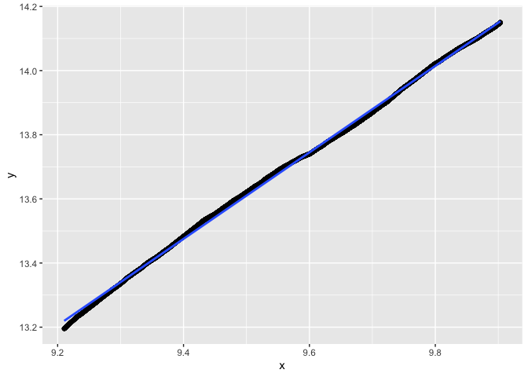<!-- -->


```r
n <- 2*10^4
data <- dataGenerator_1D(chpts = n, parameters = 0, sdNoise = 1, type = "gauss")
res3 <- dust_R_1D(data, type = "gauss", penalty = 2*log(n), pruningOpt = 2) #dust
cat(sum(res3$nb)/sum(1:n)*100, "%. Nb indices left at n: ", length(res3$lastIndexSet))
```

```
## 0.670791 %. Nb indices left at n:  116
```

```r
regIndices(res3$nb)
```

```
##              Estimate   Std. Error   t value Pr(>|t|)
## (Intercept) 0.3821443 0.0032661525  117.0014        0
## x           1.3852018 0.0003402701 4070.8891        0
```

```
## `geom_smooth()` using formula = 'y ~ x'
```

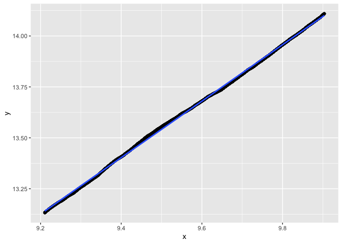<!-- -->


```r
n <- 2*10^4
data <- dataGenerator_1D(chpts = n, parameters = 0, sdNoise = 1, type = "gauss")
res3 <- dust_R_1D(data, type = "gauss", penalty = 4*log(n), pruningOpt = 3) #dust + PELT
cat(sum(res3$nb)/sum(1:n)*100, "%. Nb indices left at n: ", length(res3$lastIndexSet))
```

```
## 0.5870426 %. Nb indices left at n:  73
```

```r
regIndices(res3$nb)
```

```
##               Estimate   Std. Error   t value Pr(>|t|)
## (Intercept) -0.5696319 0.0024517812 -232.3339        0
## x            1.4685829 0.0002554283 5749.4914        0
```

```
## `geom_smooth()` using formula = 'y ~ x'
```

<!-- -->


```r
n <- 2*10^4
data <- dataGenerator_1D(chpts = n, parameters = 0, sdNoise = 1, type = "gauss")
res3 <- dust_R_1D(data, type = "gauss", penalty = 10*log(n), pruningOpt = 3) #dust + PELT
cat(sum(res3$nb)/sum(1:n)*100, "%. Nb indices left at n: ", length(res3$lastIndexSet))
```

```
## 0.4538278 %. Nb indices left at n:  60
```

```r
regIndices(res3$nb)
```

```
##               Estimate   Std. Error   t value Pr(>|t|)
## (Intercept) -0.5259323 0.0032519366 -161.7289        0
## x            1.4374746 0.0003387891 4242.9780        0
```

```
## `geom_smooth()` using formula = 'y ~ x'
```

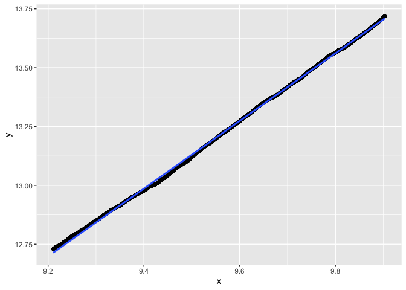<!-- -->


```r
n <- 2*10^4
data <- dataGenerator_1D(chpts = n, parameters = 0, sdNoise = 1, type = "gauss")
res3 <- dust_R_1D(data, type = "gauss", penalty = 0.1*log(n), pruningOpt = 3) #dust + PELT
cat(sum(res3$nb)/sum(1:n)*100, "%. Nb indices left at n: ", length(res3$lastIndexSet))
```

```
## 0.04723664 %. Nb indices left at n:  10
```

```r
regIndices(res3$nb)
```

```
##             Estimate   Std. Error   t value Pr(>|t|)
## (Intercept) 1.411099 0.0015016937  939.6716        0
## x           1.014302 0.0001564475 6483.3367        0
```

```
## `geom_smooth()` using formula = 'y ~ x'
```

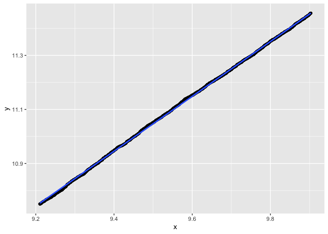<!-- -->


## Binomial


```r
n <- 2*10^4
data <- dataGenerator_1D(chpts = n, parameters = 0.5, type = "binom")
data <- data/10
res3 <- dust_R_1D(data, type = "binom", penalty = 5*log(n), pruningOpt = 2) #dust
cat(sum(res3$nb)/sum(1:n)*100, "%. Nb indices left at n: ", length(res3$lastIndexSet))
```

```
## 0.2330903 %. Nb indices left at n:  45
```

```r
regIndices(res3$nb)
```

```
##              Estimate   Std. Error   t value Pr(>|t|)
## (Intercept) -3.481016 0.0039235358 -887.2141        0
## x            1.669374 0.0004087567 4084.0292        0
```

```
## `geom_smooth()` using formula = 'y ~ x'
```

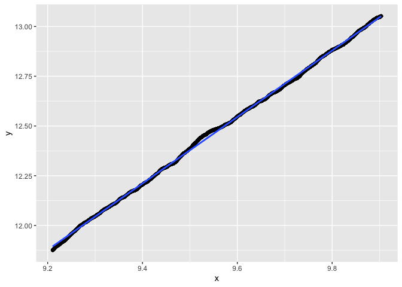<!-- -->


```r
n <- 2*10^4
data <- dataGenerator_1D(chpts = n, parameters = 0.5, type = "binom")
data <- data/10
res3 <- dust_R_1D(data, type = "binom", penalty = 20*log(n), pruningOpt = 2) #dust
cat(sum(res3$nb)/sum(1:n)*100, "%. Nb indices left at n: ", length(res3$lastIndexSet))
```

```
## 0.1004605 %. Nb indices left at n:  8
```

```r
regIndices(res3$nb)
```

```
##              Estimate   Std. Error   t value Pr(>|t|)
## (Intercept) -4.927919 0.0059486227 -828.4135        0
## x            1.731939 0.0006197317 2794.6599        0
```

```
## `geom_smooth()` using formula = 'y ~ x'
```

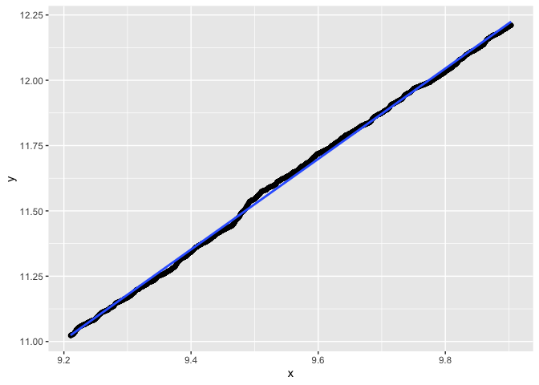<!-- -->


```r
n <- 2*10^4
data <- dataGenerator_1D(chpts = n, parameters = 0.5, type = "binom")
data <- data/10
res3 <- dust_R_1D(data, type = "binom", penalty = 0.1*log(n), pruningOpt = 2) #dust
cat(sum(res3$nb)/sum(1:n)*100, "%. Nb indices left at n: ", length(res3$lastIndexSet))
```

```
## 0.7188431 %. Nb indices left at n:  104
```

```r
regIndices(res3$nb)
```

```
##               Estimate   Std. Error   t value Pr(>|t|)
## (Intercept) -0.2378531 0.0020808119 -114.3078        0
## x            1.4560941 0.0002167805 6716.9066        0
```

```
## `geom_smooth()` using formula = 'y ~ x'
```

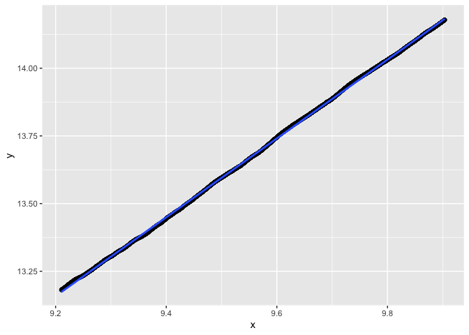<!-- -->


## Poisson


```r
n <- 2*10^4
data <- dataGenerator_1D(chpts = n, parameters = 10, type = "poisson")
res3 <- dust_R_1D(data, type = "poisson", penalty = 10*log(n), pruningOpt = 2) #dust
cat(sum(res3$nb)/sum(1:n)*100, "%. Nb indices left at n: ", length(res3$lastIndexSet))
```

```
## 0.4582346 %. Nb indices left at n:  88
```

```r
regIndices(res3$nb)
```

```
##              Estimate   Std. Error   t value Pr(>|t|)
## (Intercept) -1.771912 0.0026456211 -669.7526        0
## x            1.565306 0.0002756227 5679.1639        0
```

```
## `geom_smooth()` using formula = 'y ~ x'
```

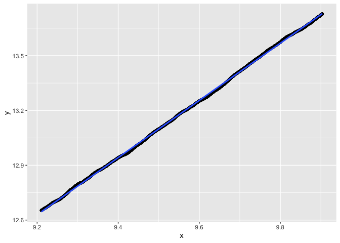<!-- -->


```r
n <- 2*10^4
data <- dataGenerator_1D(chpts = n, parameters = 10, type = "poisson")
res3 <- dust_R_1D(data, type = "poisson", penalty = 30*log(n), pruningOpt = 2) #dust
cat(sum(res3$nb)/sum(1:n)*100, "%. Nb indices left at n: ", length(res3$lastIndexSet))
```

```
## 0.3312659 %. Nb indices left at n:  64
```

```r
regIndices(res3$nb)
```

```
##              Estimate   Std. Error  t value Pr(>|t|)
## (Intercept) -3.284027 0.0093289589 -352.025        0
## x            1.684849 0.0009718976 1733.566        0
```

```
## `geom_smooth()` using formula = 'y ~ x'
```

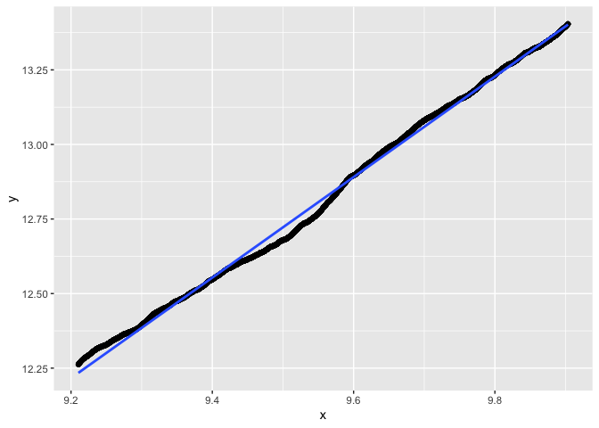<!-- -->


```r
n <- 2*10^4
data <- dataGenerator_1D(chpts = n, parameters = 10, type = "poisson")
res3 <- dust_R_1D(data, type = "poisson", penalty = 1*log(n), pruningOpt = 2) #dust
cat(sum(res3$nb)/sum(1:n)*100, "%. Nb indices left at n: ", length(res3$lastIndexSet))
```

```
## 0.7067537 %. Nb indices left at n:  114
```

```r
regIndices(res3$nb)
```

```
##              Estimate   Std. Error   t value Pr(>|t|)
## (Intercept) 0.6622904 0.0018870748  350.9614        0
## x           1.3624000 0.0001965968 6929.9198        0
```

```
## `geom_smooth()` using formula = 'y ~ x'
```

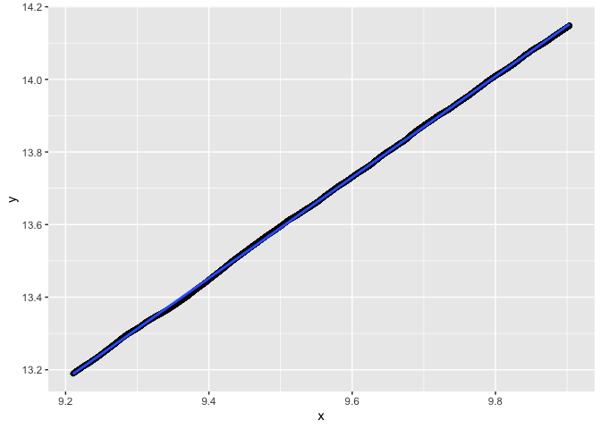<!-- -->


# Conclusions

The smaller the penalty, the more we prune. The slope is often around 1.5. Sometimes more?


Last test with `10^5` data points.


```r
n <- 10^5
data <- dataGenerator_1D(chpts = n, parameters = 0.5, type = "binom")
data <- data/10
res3 <- dust_R_1D(data, type = "binom", penalty = 1*log(n), pruningOpt = 2) #dust
cat(sum(res3$nb)/sum(1:n)*100, "%. Nb indices left at n: ", length(res3$lastIndexSet))
```

```
## 0.1934979 %. Nb indices left at n:  167
```

```r
regIndices(res3$nb)
```

```
##              Estimate   Std. Error   t value Pr(>|t|)
## (Intercept) -1.118502 0.0008697041 -1286.072        0
## x            1.495090 0.0000806416 18539.941        0
```

```
## `geom_smooth()` using formula = 'y ~ x'
```

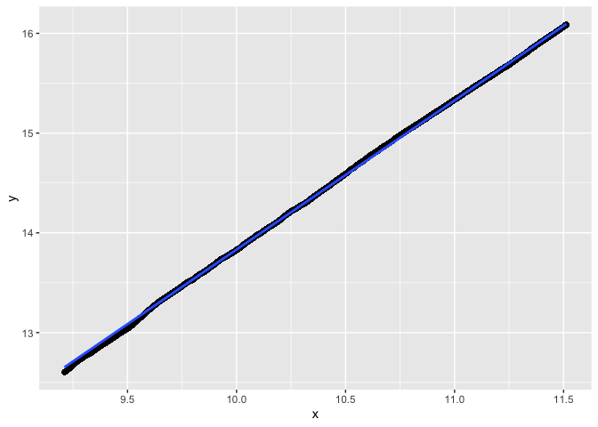<!-- -->


