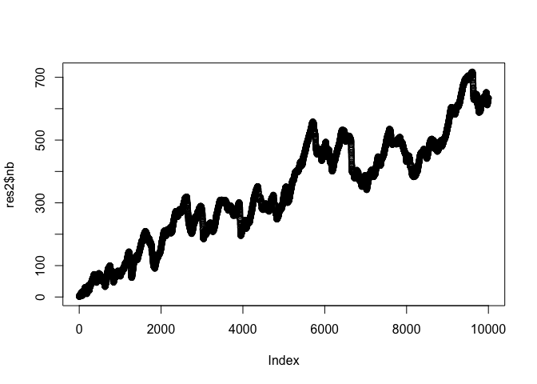

```r
library(dust) #our package
```

# Change in Mean and Variance in Gaussian model


```r
n <- 10^4
data <- dataGenerator_MV(chpts = n, 0, 1)
res2 <- dust_R_2param(data, 4*log(n), type = "meanVar", pruningOpt = 3)
plot(res2$nb)
```

<!-- -->

```r
(res2$nb[n]/n)*100
```

```
## [1] 4.92
```


# Change in simple regression model


```r
data <- dataGenerator_Reg(chpts = n, A = 1, B = 2)
res2 <- dust_R_2param(data, 4*log(n), type = "regression", pruningOpt = 3)
plot(res2$nb)
```

<!-- -->

```r
(res2$nb[n]/n)*100
```

```
## [1] 6.34
```


