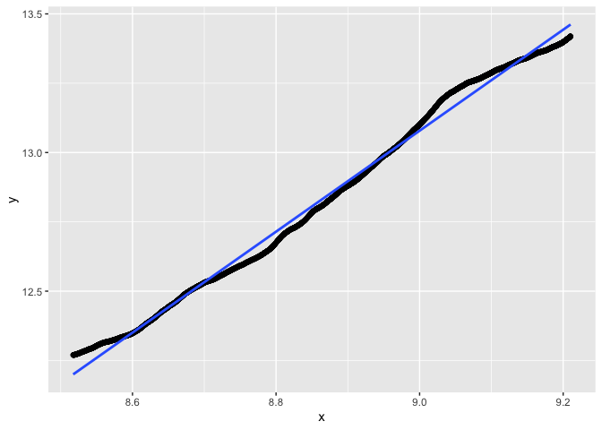

```r
library(dust) #our package
```


# Pruning capacity


## Gauss


```r
n <- 10^4
pen <- 2*log(n)
p <- 2
dataM <- dataGenerator_MultiD(n, parameters = data.frame(matrix(0, ncol = p, nrow = 1)), type = "gauss")
res3 <- dust_R_multiD(data = dataM, penalty = p*pen, type = "gauss", pruningOpt = 2)

cat(sum(res3$nb)/sum(1:n)*100, "%. Nb indices left at n: ", length(res3$lastIndexSet))
```

```
## 1.397674 %. Nb indices left at n:  88
```

```r
regIndices(res3$nb, remove = 5000)
```

```
##              Estimate  Std. Error  t value Pr(>|t|)
## (Intercept) -1.359543 0.010348489 -131.376        0
## x            1.613324 0.001162001 1388.402        0
```

```
## `geom_smooth()` using formula = 'y ~ x'
```

<!-- -->


```r
n <- 10^4
pen <- 2*log(n)
p <- 5
dataM <- dataGenerator_MultiD(n, parameters = data.frame(matrix(0, ncol = p, nrow = 1)), type = "gauss")
res3 <- dust_R_multiD(data = dataM, penalty = p*pen, type = "gauss", pruningOpt = 2)

cat(sum(res3$nb)/sum(1:n)*100, "%. Nb indices left at n: ", length(res3$lastIndexSet))
```

```
## 1.345449 %. Nb indices left at n:  148
```

```r
regIndices(res3$nb, remove = 5000)
```

```
##              Estimate  Std. Error   t value Pr(>|t|)
## (Intercept) -3.308873 0.019039287 -173.7918        0
## x            1.820845 0.002137864  851.7122        0
```

```
## `geom_smooth()` using formula = 'y ~ x'
```

<!-- -->

